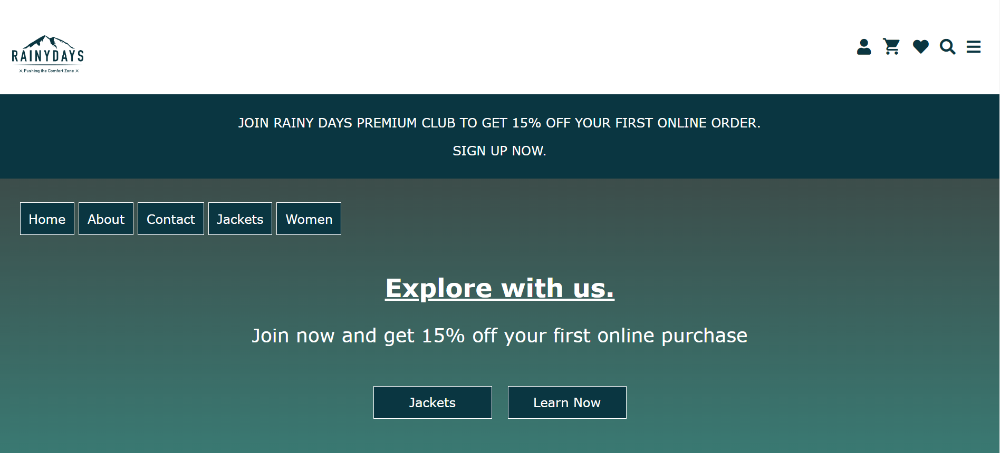

# RainyDays, Cross Course Project



A simple overview of the use/purpose of the project.

## Description

This project is about a site which is called Rainy Days, on this site the user can purchase Rainy days jackets.

- The site have a page of jackets for men.
- The site have also a jackets page for women.
- The site have also a check in and check out pages.

## Built With

This is the teck stack that I have ued to make this site:

- [React.js](https://reactjs.org/)
- [Bootstrap](https://getbootstrap.com)
- [Fontawesome](https://fontawesome.com/)
- [Hotjar](https://www.hotjar.com/)
- [Netlify](https://www.netlify.com/)

## Getting Started

### Installing

This is how you can get the project started, first clone the repo, and then install dependencies.

1. Clone the repo:

```bash
git clone git@github.com:NoroffFEU/portfolio-1-example.git
```

2. Install the dependencies:

```
npm install
```

### Running

This section shows you how the commands you`d need to run to start the project, basically how to run the app:

To run the app, run the following commands:

```bash
npm run start
```

## Contributing

Here you can detail any information you want to provide regarding contributing to the project. For big projects you will usually have a separate `CONTRIBUTING.md` and link to it, but for smaller projects you can simply include instructions here. These instructions can simply detail the process you want a person to take, such as to make sure to open a pull request so code can be reviewed.

## Contact

This is my social links if you want or need to contact me:

[My Instagram page](https://www.instagram.com/)

[My Facebook page](https://www.facebook.com/)

## License

You can link to your license file here if you're using one, or mention what license the codebase falls under. If you're unsure then you can simply delete this section.

## Acknowledgments

I would like to acknowledge all the teachers at my school and my fellow students Noroff in our class group at Discord who have always helped me when I asked for help.
